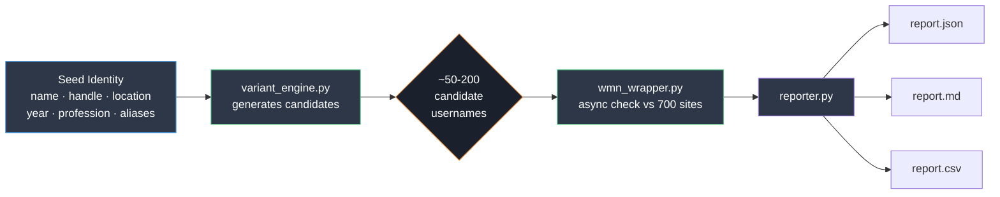
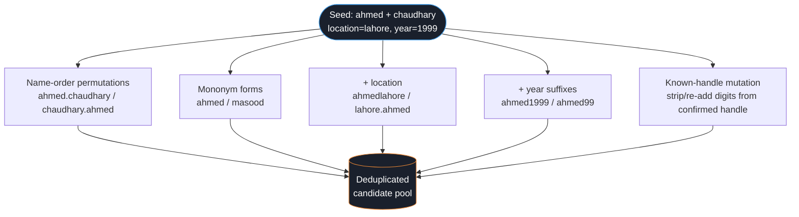
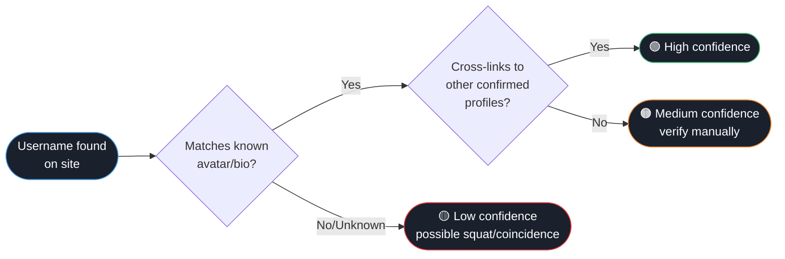

<div align="center">

#  username-variant-recon

**Async username-permutation OSINT tool built on the [WhatsMyName](https://github.com/WebBreacher/WhatsMyName) dataset.**

Generates realistic username variants from seed identity data, then checks all of them concurrently across ~700 sites — instead of only checking the one exact string you already know.

[](https://www.python.org/)
[](LICENSE)
[](https://www.python-httpx.org/)
[](https://github.com/WebBreacher/WhatsMyName)
[](tests/)
[](CONTRIBUTING.md)

</div>

---

## The problem this solves

Standard username checkers — including WMN's own original script — only check the **exact string** you feed them. Real people rarely use one consistent handle everywhere. They drop digits, swap name order, add their city, or go by a mononym on some platforms.

```
 You know:     chaudhary7807  (confirmed on one site)
 You're missing: ahmed · chaudhary.ahmed · ahmedpaki · ahmed99 · ...
```

This tool closes that gap — generate the realistic variants, check all of them, get one report.

<br>

##  How it works



<br>

##  Why async instead of the original sequential checker

```mermaid
gantt
    title Time to check 700 sites × 10 username variants
    dateFormat X
    axisFormat %s

    section Original WMN checker (sequential)
    Variant 1  : 0, 45
    Variant 2  : 45, 90
    Variant 3  : 90, 135
    "... 7 more variants" : 135, 450

    section This tool (async, concurrency=30)
    Variant 1  : 0, 4
    Variant 2  : 4, 8
    Variant 3  : 8, 12
    "... 7 more variants" : 12, 40
```



Roughly a **10x** wall-clock improvement per variant by checking sites concurrently instead of one request at a time — the difference between "run it and wait 8 minutes" and "run it and it's done before you switch tabs."

<br>

##  Variant generation logic



Unlike most username tools (which assume Western `first.last` order), this engine also generates **mononym and reordered forms** common in South Asian / MENA naming conventions — a gap in most existing OSINT tooling.

<br>

##  Quick start

```bash
git clone https://github.com/<you>/username-variant-recon.git
cd username-variant-recon
pip install -r requirements.txt
```

```bash
python3 cli.py --name Muhammad Ahmad \
    --known-handle Ahmed asad \
    --location lahore \
    --year 1999 \
    --max-variants 100 \
    --output report
```

<details>
<summary><b> Full CLI options (click to expand)</b></summary>

<br>

| Flag | Description |
|---|---|
| `--name` | One or more name tokens *(required)* |
| `--known-handle` | A confirmed real handle, used as a mutation seed |
| `--location` | City/region to try as prefix/suffix |
| `--profession` | Field/profession token to try as prefix/suffix |
| `--year` | Birth year (also tries 2-digit form) |
| `--extra` | Additional nickname/alias tokens |
| `--max-variants` | Cap on generated variants *(default 200)* |
| `--single-only` | Skip generation, check exact `--name`/`--known-handle` only |
| `--concurrency` | Max concurrent requests per username *(default 30)* |
| `--timeout` | Per-request timeout in seconds *(default 10)* |
| `--no-refresh` | Use cached dataset instead of fetching latest |
| `--output` | Output file basename *(writes `.json` / `.md` / `.csv`)* |

</details>

<details>
<summary><b> Example output (click to expand)</b></summary>

<br>

```
[*] 47 candidate username(s) to check
[*] Loading WMN dataset...
[*] 719 sites loaded
[1/47] ahmedchaudhary                 -> 3 hit(s)  (2.1s)
[2/47] chaudharyhammad                -> 6 hit(s)  (1.9s)
[3/47] ahmed.hamood                 -> 1 hit(s)  (2.3s)
...
[*] Done. 22 total hit(s) across 47 username(s).
[*] Reports written: report.json / .md / .csv
```

**`report.md` excerpt:**

```markdown
## `chaudharyahmed07` — 6 hit(s)

**coding**
- [GitHub (User)](https://github.com/chaudharyahmed07)
- [GitLab](https://gitlab.com/chaudharyahmed07)

**social**
- [Twitter/X](https://twitter.com/chaudharyahmed07)
```

</details>

<br>

##  Result confidence — read before drawing conclusions



A hit means the username **exists** on that site — nothing more. Common handles get squatted constantly. Verify manually before treating any hit as confirmed identity.

<br>

##  Roadmap

- [x] **v1** — variant generation + async WMN checking + JSON/MD/CSV reports
- [ ] **v1.1** — Cross-platform correlation: perceptual-hash photo comparison (`imagehash`) + fuzzy bio/name matching (`rapidfuzz`) to auto-flag likely-same-identity clusters
- [ ] **v1.2** — Graph output (NetworkX/pyvis) — visual entity map, Maltego-compatible CSV export
- [ ] **v1.3** — Wayback Machine fallback for deleted/deactivated accounts
- [ ] **v1.4** — Site reliability scoring using WMN's known false-positive-prone list
- [ ] **v1.5** — Stealth mode (randomized delay + UA rotation) alongside fast mode
- [ ] **v2** — Configurable naming-convention profiles beyond South Asian/MENA patterns

<br>

##  Ethics & legal use

This tool only checks **public existence** of a username via each site's normal profile-lookup response — the same request your browser makes visiting a profile URL. It does not authenticate, bypass access controls, or retrieve private data.

Use only against identities you have legitimate reason to investigate — your own accounts, authorized engagements, or personal research that doesn't violate platform ToS or harassment/stalking laws in your jurisdiction.

<br>

## Architecture

```
username-variant-recon/
├── cli.py                   # entrypoint — argparse, orchestration
├── src/
│   ├── variant_engine.py    # candidate generation (pure logic, unit-tested)
│   ├── wmn_wrapper.py       # async dataset fetch + concurrent site checks
│   └── reporter.py          # JSON / Markdown / CSV output
├── tests/
│   └── test_variant_engine.py
├── requirements.txt
└── LICENSE
```

<br>

##  Credits

Built on top of the [WhatsMyName](https://github.com/WebBreacher/WhatsMyName) dataset by Micah "WebBreacher" Hoffman and contributors — this tool wraps their data, it doesn't replace it. Go star that repo too.

<br>

<div align="center">

**License:** MIT — see [LICENSE](LICENSE)

</div>
