# Ghost-line


Ghost-line generates realistic username variants from seed identity data (name, known handle, location, birth year) and checks them against ~700 sites using the WhatsMyName dataset  concurrently, in seconds rather than minutes.


Unlike most username-checking tools, Ghost-line is built to handle naming conventions beyond the western `first.last` pattern mononyms, reordered names, and the handle styles common in South Asian and Middle Eastern contexts  which most existing tools under-generate for.
-

---



---

## Quick start

```bash
git clone https://github.com/Badarulnisa/Ghost-line.git
cd Ghost-line
pip install -r requirements.txt
```

Run a scan:

```bash
python3 cli.py --name <first> <last> --known-handle <existing_username> \
    --location <city> --year <birth_year> --output report
```

When it finishes, you'll have three files: `report.json`, `report.md`, `report.csv`.

**Only have a name?**
```bash
python3 cli.py --name jordan lee --output report
```

**Just want to check one exact username, no variant generation?**
```bash
python3 cli.py --name jordan_lee --single-only --output report
```

---

## What the flags mean

| Flag | Required | What it does |
|---|---|---|
| `--name` | Yes | One or more name tokens, e.g. `--name jordan lee` |
| `--known-handle` | No | A confirmed real handle — highest-value input, since Ghost-line mutates it directly (strips digits, tries new separators) rather than guessing from scratch |
| `--location` | No | City/region, tried as both a prefix and suffix |
| `--profession` | No | Field/role, tried as both a prefix and suffix |
| `--year` | No | 4-digit birth year — also auto-tries the 2-digit form |
| `--extra` | No | Extra nickname/alias tokens |
| `--max-variants` | No | Caps how many candidates get generated (default 200) |
| `--single-only` | No | Skips variant generation; checks only the exact `--name`/`--known-handle` strings given |
| `--concurrency` | No | Max concurrent requests across the whole run (default 60) |
| `--timeout` | No | Per-request read timeout in seconds (default 10) |
| `--no-refresh` | No | Uses the cached WMN dataset instead of pulling the latest |
| `--output` | No | Output file basename — writes `.json`, `.md`, and `.csv` (default `report`) |

---

## Reading the report

Every hit is a **candidate**, not a confirmation. A matching username on a site does not prove the same person owns it. Before treating a hit as real, cross-check:

- Avatar/profile photo
- Bio text
- Activity timing and pattern
- Links to other confirmed profiles

The markdown report also distinguishes **confirmed absent** from **unresolved** — if a site didn't respond during the run (timeout, rate limit, connection error), that's reported separately and should not be read as "username doesn't exist there." Re-run with a longer `--timeout` or lower `--concurrency` if a target shows a high unresolved count.

---

## Troubleshooting

These are the actual issues people ran into getting set up — if something looks unfamiliar, it's probably one of these.

**"fatal: destination path already exists and is not an empty directory"**
You already have a folder with that name from a previous attempt. Remove it first, then clone again:
```bash
rm -rf Ghost-line          # macOS/Linux
Remove-Item -Recurse -Force Ghost-line   # Windows PowerShell
git clone https://github.com/Badarulnisa/Ghost-line.git
```

**Cloned folder looks empty**
Two common causes:
1. You're checking the wrong folder — after cloning, `cd` *into* the new folder before listing files (`ls` / `Get-ChildItem`). If you list from one level above, it'll look empty even though the repo is fine.
2. The clone was interrupted (network drop, closed terminal mid-clone) and left a broken, git-less folder. Check with:
   ```bash
   git status
   ```
   If it says `fatal: not a git repository`, delete the folder and clone again — there's nothing to salvage.

**`python3` not recognized (Windows)**
Windows often just has `python`, not `python3`. Try:
```powershell
python cli.py --name jordan lee --output report
```

**`pip install` fails / ModuleNotFoundError when running**
You're likely not inside the project folder, or dependencies didn't install. Confirm you're in the right directory and re-run:
```bash
pip install -r requirements.txt
```

**Nothing happens / hangs on "Loading WMN dataset..."**
This step pulls the latest dataset from the network. If you're offline or the pull is slow, use the cached copy instead:
```bash
python3 cli.py --name jordan lee --no-refresh --output report
```

**Run finishes with "X site check(s) did not respond"**
Not an error — some sites just didn't respond in time. It's reported separately from real hits precisely so it isn't mistaken for a clean negative result. See "Reading the report" above.

---

## Project structure

```
Ghost-line/
├── cli.py                # entry point
├── src/
│   ├── variant_engine.py # candidate generation (pure, no I/O)
│   ├── wmn_wrapper.py     # async site-checking engine
│   └── reporter.py        # JSON/Markdown/CSV report writers
├── tests/
└── requirements.txt
```

## License

MIT